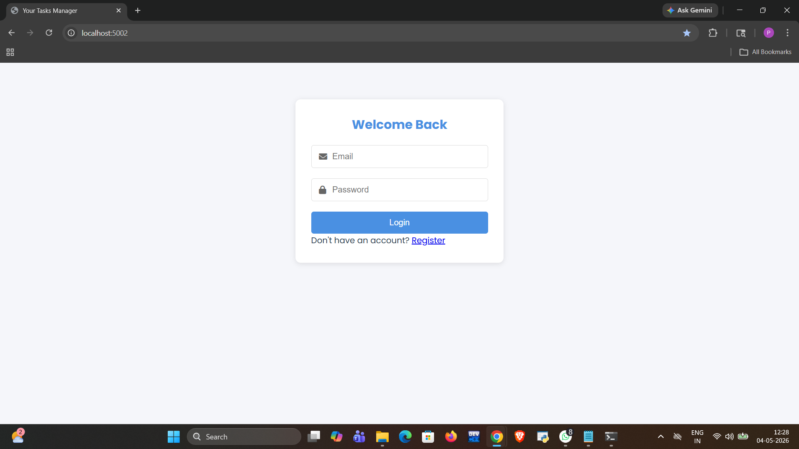
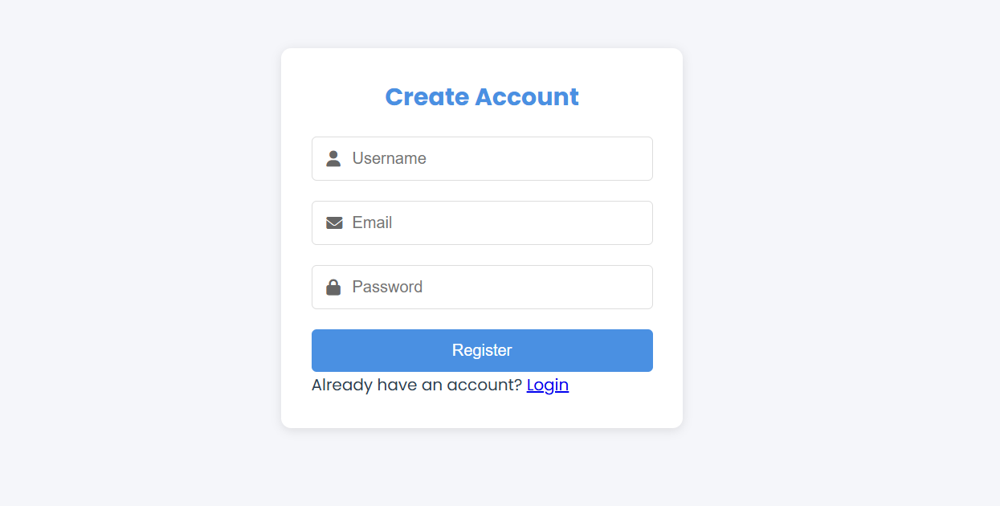
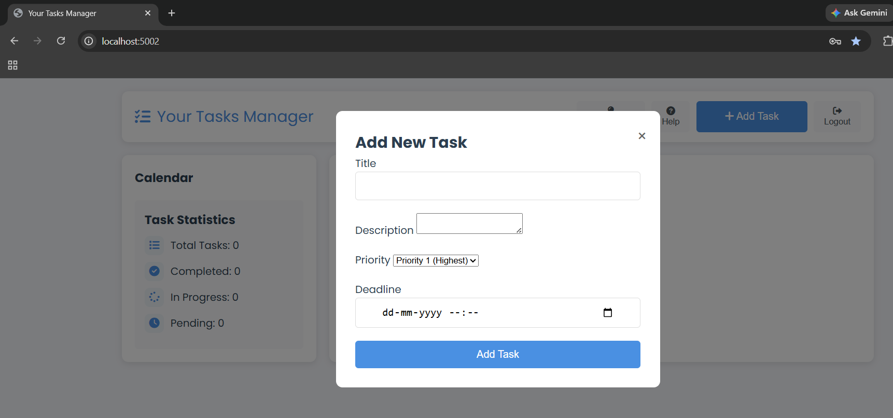
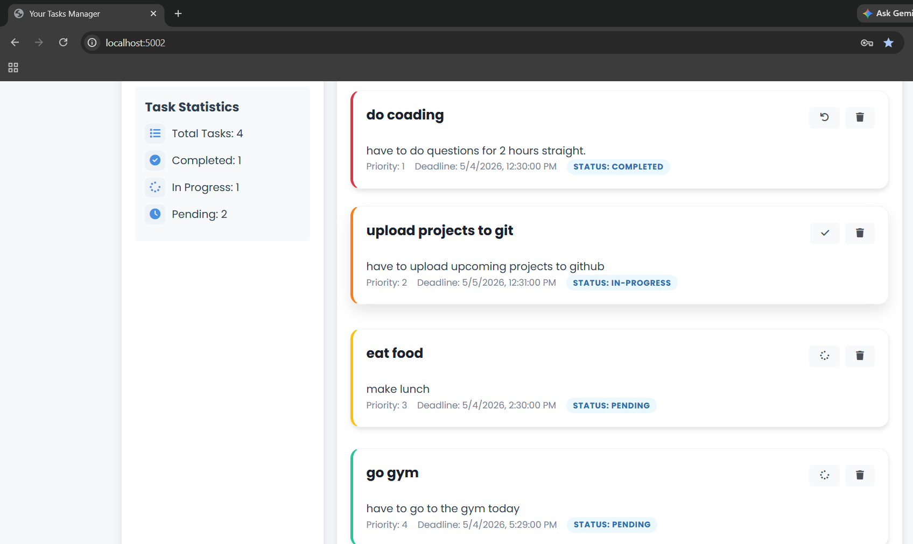
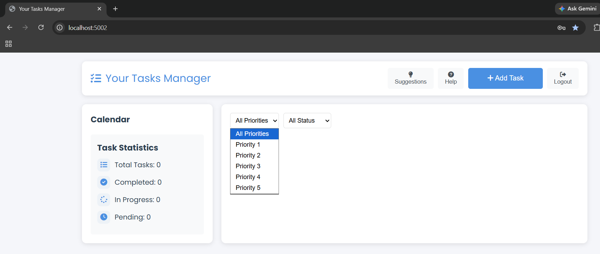

# Your Tasks Manager

A modern task management application built with Node.js, Express, MongoDB, and vanilla JavaScript. The application implements Priority Scheduling algorithm for task management, where tasks are automatically sorted based on their priority levels (1-5) and First-Come-First-Serve (FCFS) for tasks with the same priority.

## Features

- User Authentication (Register/Login)
- Priority-based Task Management (1-5)
- Task Status Updates (Pending/In Progress/Completed)
- Deadline Management
- Task Filtering by Priority and Status
- Task Statistics
- Responsive Design
- Modern UI with Animations
- Calendar Integration
- Deadline Notifications

## Prerequisites

- Node.js (v14 or higher)
- MongoDB
- npm or yarn

## Installation

1. Clone the repository:
```bash
git clone <repository-url>
cd task-manager
```

2. Install dependencies:
```bash
npm install
```

3. Create a `.env` file in the root directory with the following variables:
```
MONGODB_URI=mongodb://localhost:27017/task-manager
JWT_SECRET=your-secret-key
PORT=5000
```

4. Start MongoDB service on your machine

5. Start the application:
```bash
# Development mode
npm run dev

# Production mode
npm start
```

6. Open your browser and navigate to `http://localhost:5000`

7. . ## 📸 Screenshots

### 🔐 Login Page


### 📝 Register Page


### ➕ Add Task


### 📋 Managed Tasks


### ⚡ Priority Queue


## Project Structure

```
task-manager/
├── models/
│   ├── User.js
│   └── Task.js
├── routes/
│   ├── auth.js
│   └── tasks.js
├── middleware/
│   └── auth.js
├── public/
│   ├── index.html
│   ├── styles.css
│   └── app.js
├── server.js
├── package.json
└── README.md
```

## API Endpoints

### Authentication
- POST `/api/auth/register` - Register a new user
- POST `/api/auth/login` - Login user

### Tasks
- GET `/api/tasks` - Get all tasks
- POST `/api/tasks` - Create a new task
- PUT `/api/tasks/:id` - Update a task
- DELETE `/api/tasks/:id` - Delete a task

## Technologies Used

- Backend:
  - Node.js
  - Express.js
  - MongoDB
  - Mongoose
  - JWT Authentication
  - bcryptjs

- Frontend:
  - HTML5
  - CSS3
  - JavaScript (ES6+)
  - Font Awesome Icons
  - Google Fonts

## Contributing

1. Fork the repository
2. Create your feature branch (`git checkout -b feature/AmazingFeature`)
3. Commit your changes (`git commit -m 'Add some AmazingFeature'`)
4. Push to the branch (`git push origin feature/AmazingFeature`)
5. Open a Pull Request

## License

This project is licensed under the MIT License - see the LICENSE file for details. 
